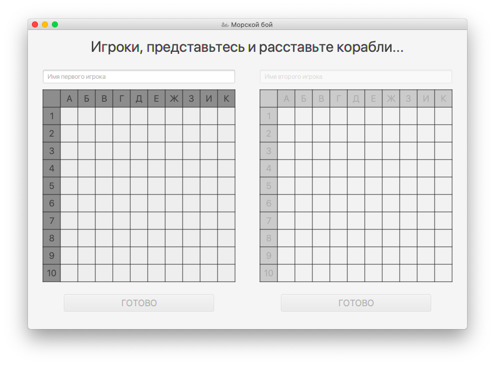
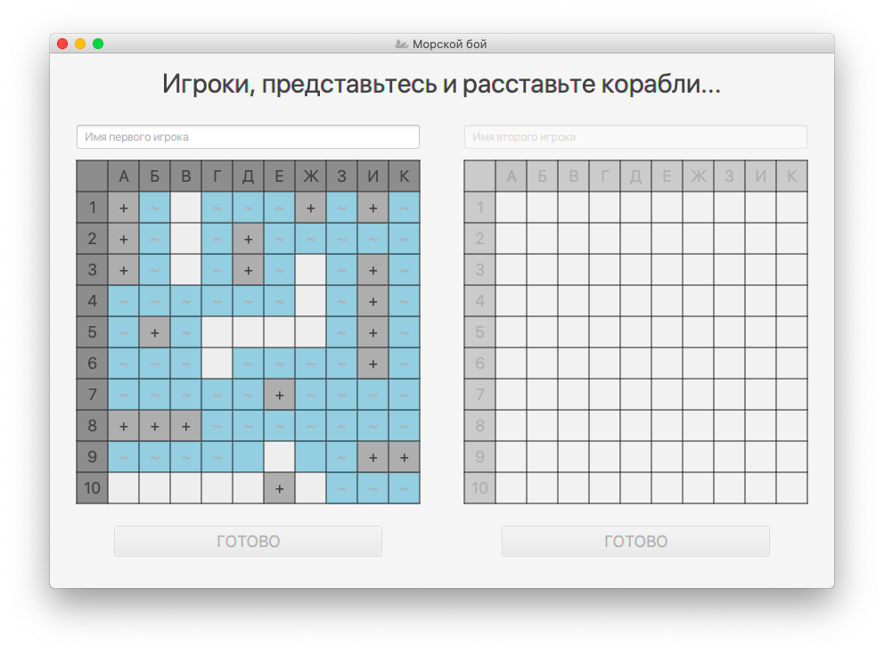
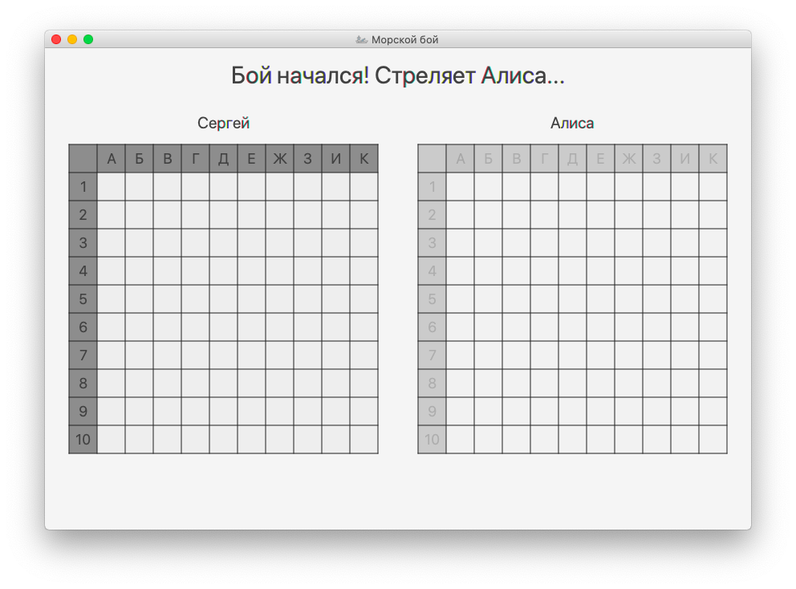
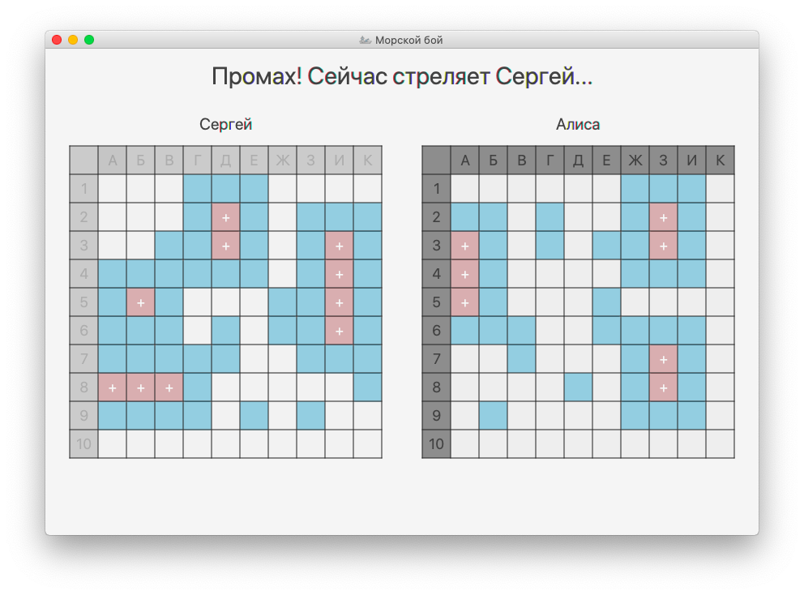
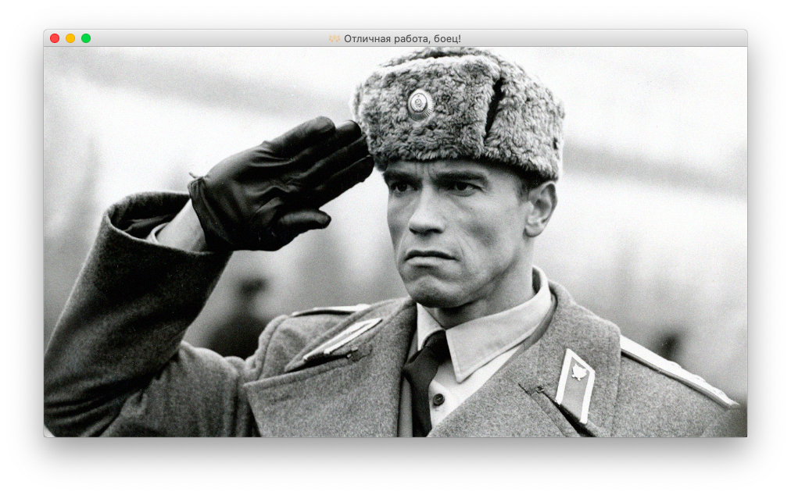
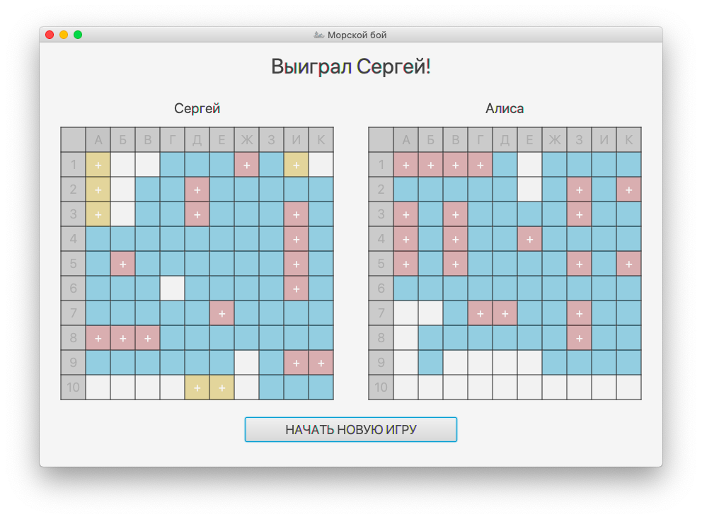

# SeaBattle

Данная версия игры написана на JavaFX.

«Морской бой» — игра для двух участников, в которой игроки по очереди называют координаты на неизвестной им карте соперника. Если у соперника по этим координатам имеется корабль (координаты заняты), то корабль или его часть «топится», а попавший получает право сделать ещё один ход. Цель игрока — первым потопить все корабли противника.

